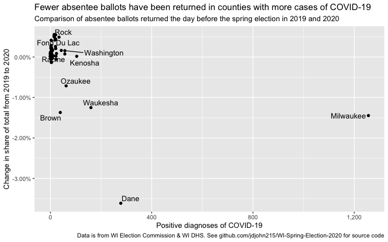

Fewer absentee ballots have been returned in counties with more
(diagnosed) cases of COVID-19
================
John Johnson
4/6/2020

As of 3:00pm on Monday, April 6th Wisconsin has reported 2,440 positive
diagnoses of COVID-19. Of these, 1,860 (or 76%) are in the 5 hardest-hit
counties: Milwaukee, Dane, Waukesha, Kenosha, and Ozaukee. Each county
except Kenosha has seen it’s share of the absentee-ballot electorate
fall from the 2019 Spring election to the 2020 Spring election.

**Collectively, the share of absentee ballots returned in these 5
counties has declined 7%, from 51.3% of statewide ballots in 2019 to
44.3% in 2020.**

See the code in this repo for how these stats were calculated.

<!-- -->
